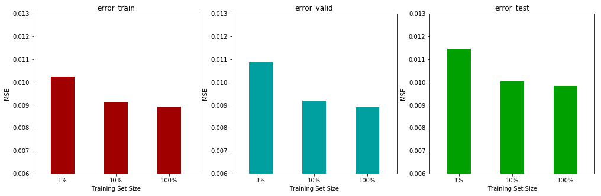
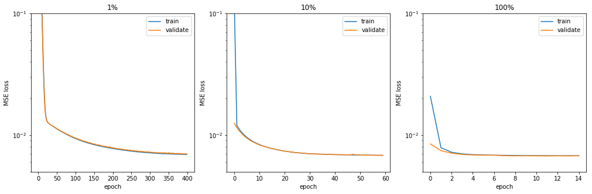
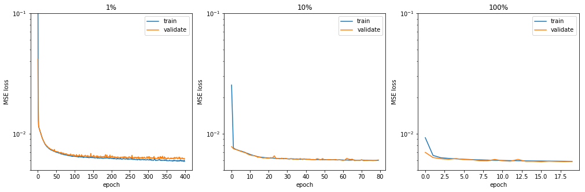
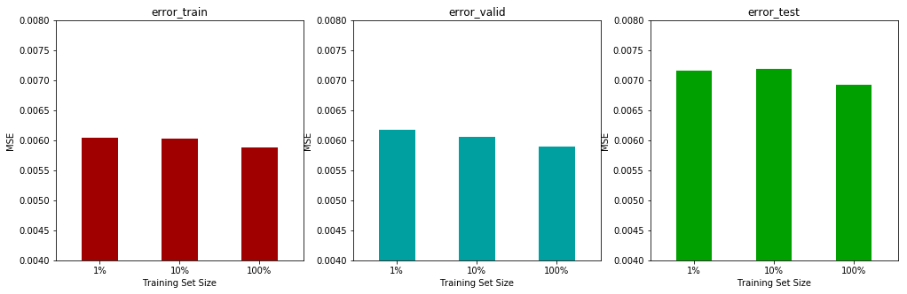
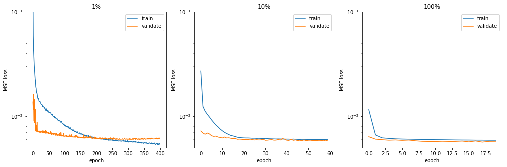
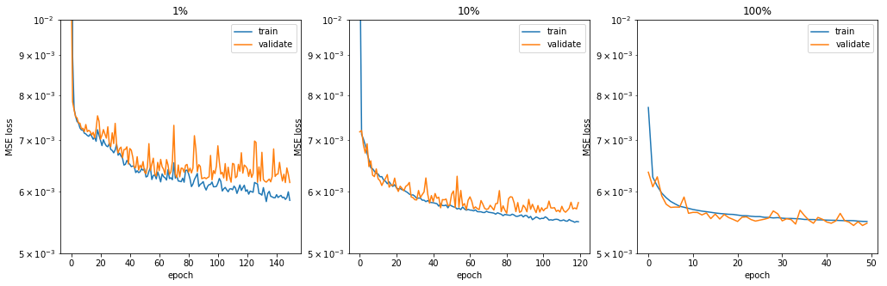
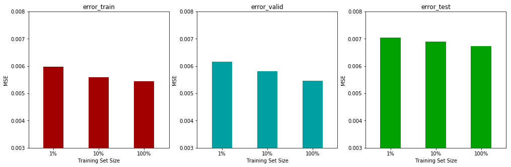
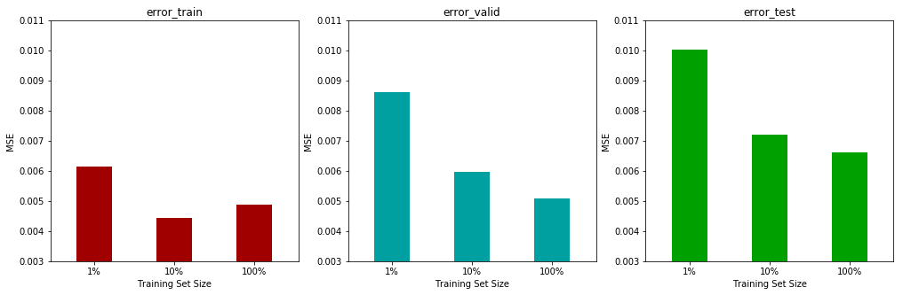
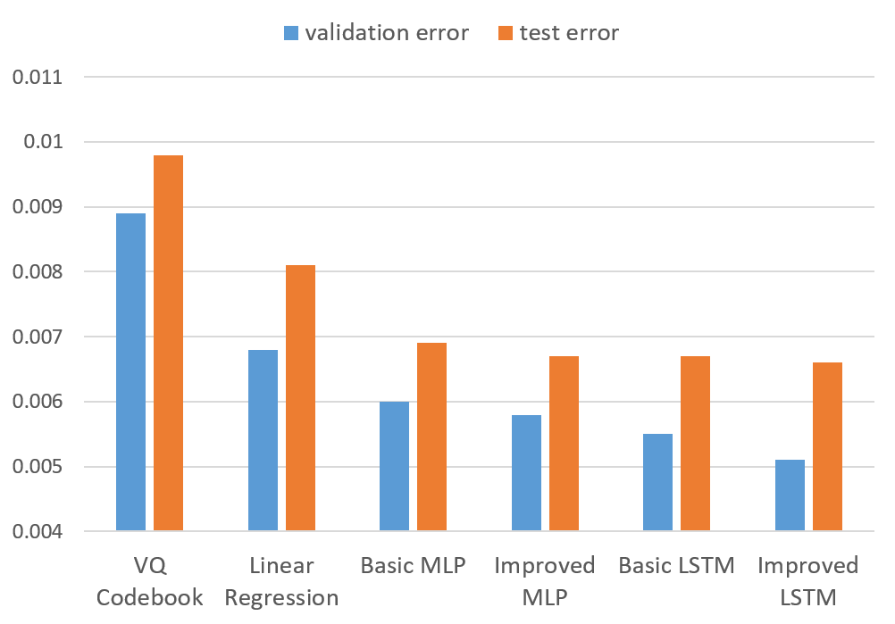

# Machine Learning Engineer Nanodegree
## Capstone Project
Sen Li  
March 25th, 2018

## I. Definition
### Project Overview
Until a few years ago, the quality of voice telecommunications has been limited by design choices made over 100 years ago, which resulted in an 8 kHz sampling rate being used and in a practical frequency range of 300 – 3400 Hz. This so called narrowband (NB) frequency range severely limited speech quality. Recently, the industry has started to move to “HD voice” and “Ultra HD voice”, for example, the use of wideband (WB) or super-wideband (SWB) speech coders respectively, which use a sampling rate of 16 kHz or 32 kHz and correspond to a frequency range of 50-7000 Hz or 50 –14000 Hz respectively [1][2].

However, these deployments are not ubiquitous. A whole new infrastructure is needed to support these WB and SWB coders, at a substantial cost. It will likely take years before complete coverage is achieved. Until then, a significant proportion of calls will still use legacy narrowband. Further, it is likely that landline upgrades to WB or SWB will take even longer, meaning that even when the mobile networks have fully migrated to higher bandwidths, calls from landlines will still be narrowband.

Blind bandwidth extension (BBE) technology aims at solving this problem by transforming NB speech into WB or SWB speech. Typically using some form of either spectral folding or statistical modelling, the 4-8 kHz part of a speech signal is predicted from the 0-4 kHz part, to generate a signal having the general characteristics of wideband speech [3][4]. While perfect prediction cannot be expected, reasonably high quality speech can be obtained. In this project, we focused on predicting the 4-8 kHz portion of speech, usually referred to as the high-band (HB), from the 0-4 kHz portion, known as the low-band (LB).


### Problem Statement

Various approaches to BBE have been proposed and studied. Vector Quantization (VQ) codebook mapping is one of the classical method, which creates discreet mapping of speech parameters from LB to HB [5][6]. Gaussian Mixture Models(GMM) based method are used to preserve a more accurate transformation between LB and HB by modeling the speech envelope parameter continuously [7]. Hidden Markov Model (HMM) was the extension of GMM to improve the quality during speech transition by exploiting speech temporal information [8]. Recent advancement in neural networks learning, especially deep learning, suggested that such framework may have the potential to model complex non-linear relationship between speech LB and HB, which leads to our proposal of this project. 

In this project, we studied several neural network based models, including multi-layer perceptron (MLP) and long short-term memory (LSTM), for BBE. In particular, the model input are speech LB line spectral frequencies (LSFs)  and the model output are speech HB LSFs. The model training diagram can be seen in the Figure below.


### Metrics

In this project, we adopted the mean squared error (MSE) in LSF feature domain as the metric to quantify model performance. The MSE is calculated between model predicted HB LSFs and the reference HB LSFs derived from true wideband speech. The lower the score, the better the prediction model perform. The reason that we choose MSE as our metric is because we are using LSFs as our input and output features in our model. LSFs characterize the locations of speech formant in frequency domain and LSF dimensions have similar weight across dataset, therefore, MSE between two set of LSFs should be a reasonable metric to indicate how close the two set speech spectral shape are. The mathematical expression is,

​                                                                      $MSE = \frac{1}{n}  \sum\limits_{i=1}^{n}(y_p  -  y) ^2$ , 

where $n$ is the total number of data, $y_p$ is the predicted HB LSFs, and $y$ is the reference HB LSFs, or the ground truth. We established that deep neural network based models would be able to capture complex non-linear relationship between speech LB and HB and thus yield better MSE.


## II. Analysis

### Data Exploration
Since the BBE should be a generic speech enhancement algorithm, it should perform equally well for both male and female, and across various talkers and different languages. The ideal dataset for this project would be a multi-lingual speech database that contains multiple talkers and covers many languages. We decided to use the NTT 1994 multi-lingual corpus, containing 21 languages, 4 female and 4 male talkers for each of the language [9]. Unfortunately, this speech corpus is not publicly available for free and the size of dataset is very large, we therefore extracted the speech features from the raw speech signal for the project purpose. For our test inputs, we evaluated the BBE performance on ITU P.501 British English test signal [10]. 

The data that we used for training and testing the models are the speech spectral shape features extracted from the raw speech waveform. Line spectral frequency is a classical spectral representation of speech, not only because its compact representation, compared to a 512-point or 1024-point FFT, but also because of its noise robust numerical property that made it insensitive to coding noise. LSFs also contain valuable information regarding the stableness of the vocal tract filter. The LSF values lie between (0, pi/2) in the radius frequency domain and the values are in monotonic increasing order, indicating a stable vocal tract filter response. The Figure below shows a typical 10th-order LB LSF.


Given the interesting property of LSFs, we also investigated their distribution across training dataset. The Figure below shows the histogram of all LB LSF features used for training. We can observe that all the 10 dimensions of the feature are close to Gaussian distribution, except for some minor tails on both side of the dimension. As we discussed above, all the LSFs are within 0 and pi/2 and the LSF distribution are close to the optimal region for input features, that most neural network operates upon. Given such properties and considered to keep the ordering of LSFs, we decided not to do special handling for input normalization and transformation. Even though we noticed that the mean of each dimension is not centered at 0, hopefully the bias parameters in the neural network model should be more than sufficient to compensate for this.


The HB LSFs distribution of the training dataset is close to that of LB LSFs, as shown in the Figure below. It is important to note that all the data used in these figures has already went through several necessary pre-processing steps, as described in data pre-processing section, from which all the abnormalities and outliers were removed. Since we pruned the background silence from the original speech corpus before extracting the speech features, the distribution here is truly representing the active speech.


### Exploratory Visualization
Normally the LSFs come in pairs and each pair of LSFs normally indicates the location of speech formant, or energy peak in frequency domain. The closer a pair of LSFs are, the more energy the formant contains, translating to a sharper peak in frequency domain. The Figure below illustrates several examples of 10th-order LB LSFs from the training dataset.


Different from the LB LSFs, which contain the most of human speech energy and have many strong formants, speech HB formants are flatter and contain much less energy, resulting in a much spread out distribution of LSF values - no pair of LSF stays close, as shown in the Figure below, which correspond to the three LB LSFs in the Figure above.


### Algorithms and Techniques
In this project, we built and implemented four neural network based models for speech HB spectral shape prediction. We focused on two types of neural network architecture - MLP and LSTM. 

A MLP network model is a class of feedforward neural network that contains at least three layers of nodes, including input nodes and output nodes. Each node is a neuron that uses a non-linear activation function, such as sigmoid functions [14]. MLP utilizes backpropagation algorithm for training by comparing the amount of error between the predicted output and the expected output, and further update model parameters at each layer. Thanks to its non-linear property, MLP can model highly complex functions and can distinguish data that are not linearly separable.

An LSTM network model is one variant of recurrent neural network (RNN) that composed by the LSTM units. A common LSTM unit is composed of a cell that carries internal memory and three gates: input gate, output data and forget gate [15]. LSTM network takes time series input data at each time step and is trained with backpropagation through time by changing the weight in proportion to its derivative respect to the error for each time step. Due to the recurrent structure and the way that LSTM unit are designed, LSTM networks are good at learning temporal information even for a very long time span.

We started by building a basic MLP model with only one hidden layer to evaluate the advantage by using non-linear modeling compared to traditional linear regression modeling and conventional clustering approaches. We later extended the basic MLP model with a deeper architecture. As discussed above, the input and output features are all LSFs. From our past experience with speech related problems, including the delta features in the input will help in general, to produce more accurate and smooth predictions given the fact that it brings speech temporal information in an explicit way. This has also been validated by our experiments in this BBE prediction problem and therefore, we adopted the delta features as our standard configuration. 

Since we learned that speech temporal information will help the speech HB spectral prediction, we further investigated the use of LSTM model, which is good at utilizing temporal information with its recurrent architecture. Similar to the methodology for MLP models, we started by building a basic LSTM model with one LSTM layers and explored various potential improvements on it.


### Benchmark
We trained two classical benchmark models given the same input LB spectral features and the output HB spectral features for our comparison: 

- 1-best VQ codebook mapping model. 
- Linear regression model.

For the VQ codebook mapping model, we trained a 256-entry codebook for LB LSFs concatenated with HB LSFs using K-Means algorithm. In the prediction phase, we took the spectral features from NB speech signal and calculated the nearest neighbor codebook entry based on the spectral distance and synthesize the corresponding HB spectral features. The model performance results were measured by the MSE in the spectral feature domain. 

We adopted the methodology by training our model on 1%, 10% and 100% of the training data and evaluated the model through training error, validation error and testing error respectively. The classical 1-best VQ code book mapping model provided a decent low bar to start with, given the fact that it is a 30 years old technology. In general, the more data for training, the better performance on validation and testing data, as we can see from the Table and Figure below. One observation is testing error is worse than training and validation error due to the fact that training and validation data are for all 21 languages in the corpus, the testing data is British English, therefore, the error can be slightly worse, but if tested on other languages, the error might be better. 

From the results below, with the full training set, the best MSE on validation set is 0.0089, and the best MSE on testing set is 0.0098. These results are far from perfect, but from previous literatures, models like this one can still give descent output speech. Several improvements can be made by using weighted N-best clustering entries or using soft clustering algorithms, such as GMM. These will not be discussed in this project.


| VQ Codebook | training error | validation error | testing error |
| :---------: | :------------: | :--------------: | :-----------: |
|     1%      |     0.0102     |      0.0109      |    0.0114     |
|     10%     |     0.0091     |      0.0092      |     0.01      |
|    100%     |     0.0089     |      0.0089      |    0.0098     |





For the linear regression model, we trained a model to learn the direct linear mapping function from LB LSFs to HB LSFs by minimizing the MSE. The optimization is done through gradient descent algorithm. The code for the model definition using Keras is as follows, where the dim_in and dim_out reflected the input and output dimension, the metric is MSE and since this is linear regression model, the activation function is linear.

```
def linear_regression(dim_in, dim_out):
    """
    Linear regression model
    dim_in: input dimension
    dim_out: output dimension
    """
	model = Sequential()
	model.add(Dense(dim_out, input_shape=(dim_in,), activation='linear'))
	model.compile(loss='mse', optimizer='adam')
	model.summary()
	return model
```

As shown in the Figure below, the model was trained using 1%, 10%, and 100% of the data until fully converge. Training error, validation error and testing error were all getting better as more data used in the training. We can already see the power of more data by comparing this model to the conventional VQ codebook mapping model. The performance of linear regression model are better than VQ codebook model across the board with various training data size. The reasonable good performance of this linear regression model makes it another good benchmark model to compare against.


| Linear Regression | training error | validation error | testing error |
| :---------------: | :------------: | :--------------: | :-----------: |
|        1%         |     0.0070     |      0.0070      |    0.0086     |
|        10%        |     0.0068     |      0.0068      |    0.0082     |
|       100%        |     0.0068     |      0.0068      |    0.0081     |





## III. Methodology
### Data Preprocessing
Given that we are using the multi-lingual NTT 1994 corpus and it is not publicly available, we will need to perform pre-processing of the dataset and extract the speech features that we can directly use as the input and output training data for our project. 

The wideband speech data from the corpus is sampled at 16 kHz sampling rate and digitized into 16-bit resolution.The ITU P.341 Tx filter is applied to the wideband speech to simulate the typical Tx response in the telecommunication system before speech parameter extraction for both low-band and high-band. Given the parameterized speech data, we prepared the training and validation data with the classical 10-fold cross validation scheme for training. 

The same pre-processing and feature extraction procedure was applied to the test input speech as well, which is from ITU P.501 British English test signal. Since the original P.501 English test signal is sampled at 48 kHz, a 3:1 down sampling is required to convert it to wideband speech, sampled at 16 kHz and a further 2:1 down sampling is required to convert it to narrowband speech, sampled at 8 kHz. All the sampling rate conversion can be achieved using standardized ITU G.191 STL speech tools [11].

One problem still remains though, is for general speech related problems, especially for clean speech corpus, the background silence is not the point of interest. Voice activity detection (VAD) algorithms, which is implemented in many standardized speech coders, can effectively remove most of the silence within the recording, so that the feature that we extracted is truly representing the active speech. 


### Implementation and Refinement

All the neural network based models were built with Keras [12] toolkit using the Tensorflow [13] backend. Adam optimizer and back propagation were used for training and optimization. We implemented two types of neural network models - MLP and LSTM.

##### Multi Layer Perceptron (MLP)

Our basic MLP model used one hidden layer of 128 neurons, dropout is turned off for this model due to the fact that the total number of parameters are small (total model parameters: 3462) and from the simulation, it is not over fitting the data. We tried 256, 512 and 1024 neurons for the hidden layer, but didn't make significant improvement while adding a lot more parameters to train. We adopted the default learning rate of 1e-3 for Adam optimizer. We called this model 'basic MLP'. 

We extended the basic MLP model to a deeper and wider architecture with 3 hidden layers, 256 neurons for each of the hidden layer. Due to the deeper and wider architecture of the model, the number of total parameters increase by 40X to 138502. In order to generalize well, we introduced dropout for each of the hidden layer with a 50% drop probability. We called this model 'improved MLP'. 

​The code for the MLP model definition using Keras is as follows, where 'nl' is the number of hidden layers and 'nn' indicated the number of neurons in each of the hidden layer, 

```
def mlp(dim_in, dim_out, nl=1, nn=128, dropout=False):
    """
    Multilayer perceptron network
    dim_in: input dimension
    dim_out: output dimension
    nl: number of hidden layers
    nn: number of neurons in each hidden layer
    dropout: whether to use dropout in hidden layer
    """
    model = Sequential()
    model.add(Dense(nn, input_shape=(dim_in,), activation='relu'))
    for i in range(nl-1):
        model.add(Dense(nn, activation='relu'))
        if dropout:
            model.add(Dropout(0.5))
    model.add(Dense(dim_out))
    model.compile(loss='mse', optimizer='adam')
    model.summary()
    return model
```


##### Long Short Term Memory (LSTM)

Since we learned that temporal information will help the speech HB spectral prediction, we implemented a basic LSTM model with 2 time steps, note that the standard MLP has only 1 time step, we used 64 LSTM units for the recurrent layer. LSTM normally trains slower compared to MLP models with similar size, we increase the learning rate to 1e-2 to allow for faster convergence. We called this model the 'basic LSTM'.

Similar to the methodology for MLP models, we improved the basic LSTM model. We stacked two recurrent layers and extended the time step to 5 and deliberately delayed the input feature by 2 time step to allow the network to learn from near future information. This model produced further improvement over the basic LSTM model. We called this model 'improved LSTM'.

The code for the LSTM model definition using Keras is as follows,

```
def lstm(dim_in, dim_out, time_step, nl=1, nn=32):
    """
    Long short-term memory network
    dim_in: input dimension
    dim_out: output dimension
    time_step: number of time step
    nl: number of stacks of LSTM layer
    nn: number of LSTM unit in each LSTM stack
    """
    model = Sequential()
    model.add(LSTM(nn, return_sequences=bool(nl-1), input_shape=(time_step, dim_in)))
    if nl > 1:
        for nl in range(nl-2):
            model.add(LSTM(nn, return_sequences=True))
        model.add(LSTM(nn, return_sequences=False))
    model.add(Dense(dim_out))
    model.compile(loss='mse', optimizer='adam')
    model.summary()
    return model
```


## IV. Results
### Model Evaluation and Validation
##### Basic MLP model

The results of the basic MLP model can be found below, we trained the model using 1%, 10% and 100% of the training data and evaluated on training error, validation error and testing error respectively. We took special caution to make sure there are sufficient training epochs for the model with small training set to converge. The error for validation and testing data were getting lower along with more training data. The final MSE on validation set is 0.0060 and MSE on testing set is 0.0069. This basic starter model have already demonstrated the advantage by using non-linear modeling compared to traditional linear regression modeling, achieving relative improvements of 11.8% and 14.8% on validation and testing set respectively.


| Basic MLP | training error | validation error | testing error |
| :-------: | :------------: | :--------------: | :-----------: |
|    1%     |     0.0060     |      0.0062      |    0.0072     |
|    10%    |     0.0060     |      0.0061      |    0.0072     |
|   100%    |     0.0059     |      0.0060      |    0.0069     |








##### Improved MLP model

We improved the basic MLP model with 256 neurons for each layer in a deeper architecture with 3 hidden layers. Due to the increasing number of parameters to train the model, we introduced 50% dropout rate for each of the hidden layers. With the help of a deeper and wider model, we could achieve another 3.3% and 2.9% MSE improvements on validation and testing set respectively, however at the cost of increasing total training parameters to 138502, a factor of 40X. We also experimented with more deeper and wider MLP models and didn't observe better performance. The results are shown in the Table and Figure below.


| Improved MLP | training error | validation error | testing error |
| :----------: | :------------: | :--------------: | :-----------: |
|      1%      |     0.0057     |      0.0061      |    0.0073     |
|     10%      |     0.0057     |      0.0058      |    0.0068     |
|     100%     |     0.0057     |      0.0058      |    0.0067     |





##### Basic LSTM model

In order to utilize temporal information from the dataset, we implemented the basic LSTM model with 1 recurrent layer containing 64 LSTM units. The total number of parameters from the model is 22150. With the help of recurrent architecture and temporal knowledge, we gained another error reduction of 5.1% on validation data and achieved similar error on testing data, compared to improved MLP model, but with more than 6X reduction in total number of model parameters. The results are shown below.


| Basic LSTM | training error | validation error | testing error |
| :--------: | :------------: | :--------------: | :-----------: |
|     1%     |     0.0060     |      0.0062      |    0.0070     |
|    10%     |     0.0056     |      0.0058      |    0.0070     |
|    100%    |     0.0054     |      0.0055      |    0.0067     |








##### Improved LSTM model

We also extended the basic LSTM model by allowing more temporal information in the input and incorporate future knowledge into the training. We observed that training and validation error getting even lower, meaning the model itself is more powerful in modeling data and we also slightly improve the testing error. We also explored more complex configurations by stacking more recurrent layer and add more LSTM unit at each layer, but seems that we have reached the limit of this type of model based on the training data. The results are shown below.


| Improved LSTM | training error | validation error | testing error |
| :-----------: | :------------: | :--------------: | :-----------: |
|      1%       |     0.0062     |      0.0086      |    0.0010     |
|      10%      |     0.0058     |      0.0059      |    0.0072     |
|     100%      |     0.0049     |      0.0051      |    0.0066     |





### Justification
After evaluating on all the models discussed above, the Table below summarized our final results based on testing and validation dataset. 

| model               | validation error | test error |
| ------------------- | ---------------- | ---------- |
| VQ Codebook Mapping | 0.0089           | 0.0098     |
| Linear Regression   | 0.0068           | 0.0081     |
| MLP                 | 0.0060           | 0.0069     |
| Improved MLP        | 0.0058           | 0.0067     |
| LSTM                | 0.0055           | 00067      |
| Improved LSTM       | 0.0051           | 0.0066     |

Compared to the conventional benchmark models, including VQ codebook mapping and linear regression, all the neural network based models showed the strengths by accurately modelled the non-linear relationship between speech LB spectral shape and HB spectral shape, which is within our expectation. Given all the results below, I would choose the improved LSTM model as my final model, given the fact that it achieved the lowest error in both validation and testing set. Given the fact that the conventional VQ codebook mapping have already produced reasonable output speech quality [5], and our final model achieved a stunning 32% improvement on top of it. This is a convincing fact that our final model should be a good candidate for this bandwidth extension problem. The final ranking are illustrated in the Figure below.





To further validate the robustness of our model, we conducted the K-fold cross validation, where we used 10 folds. Each fold is used once for validation while the remaining 9 folds form the training set. The Table below listed the training and validation MSE. The cross validation results are consistent across each fold  and reconfirm the robustness our final model. We note that the testing error varies more, this is totally expected, where the testing data is British English and training and validation data randomly covers all languages. If the training data happens to have more British English samples, the testing error will be better, but results on other languages might get a slightly worse and vice versa.

| 10-Fold Cross Validation | validation error | testing error |
| :----------------------: | :--------------: | :-----------: |
|            1             |     0.00509      |    0.00678    |
|            2             |     0.00511      |    0.00722    |
|            3             |     0.00523      |    0.00702    |
|            4             |     0.00515      |    0.00681    |
|            5             |     0.00525      |    0.00686    |
|            6             |     0.00516      |    0.00633    |
|            7             |     0.00524      |    0.00686    |
|            8             |     0.00514      |    0.0066     |
|            9             |     0.00517      |    0.00654    |
|            10            |     0.00506      |    0.00658    |


## V. Conclusion
In this project, we successfully demonstrated that neural network based models are suitable for learning the complexity non-linear relationship between speech LB and HB spectral shape. Properly trained MLP and LSTM models can achieve significant improvement over the conventional approaches. 

Admittedly, in this project, we only covered the speech spectral shape prediction module in a typical BBE system, which has many other important modules as well. The Figure below shows a typical BBE system, which operates on encoded NB bitstream from AMR, which has been deployed globally as the 3G speech codec. We can see from the diagram that other than HB parameters prediction module, there are modules to synthesis the HB excitation signal form the LB excitation signal, or residual. There is a synthesis filter bank module to combine the 0 - 4 kHz LB speech with the predicted 4 - 8 kHz HB speech to finally produced the extended wideband speech.


Here, we present a group of Figures of WB spectrogram, it is a standard representation of speech in time-frequency domain using Short Time Fourier Transform (STFT).  The Figures are in the order of true WB speech, NB speech and BBE WB speech respectively. We can observe that even though the blindly predicted WB speech could not match the original energy in WB speech, it has already recovered most of the speech content above 4 kHz. Nowadays, BBE technologies have been commercialized in several global markets and are also used to help the elderly people with hearing loss to improve their voice and sound perception.


### Reflection
There are many things we learned from this project, ranging from how to implement various neural network models to how to properly train, evaluate, compare across diffrent models. However, two things I've found are worth mentioning here when I review this project. 

In the data preparation step, as all the machine learning tutorials suggested that one should do feature normalization before giving them to the neural network for training. While this is true in general that the normalized feature can reduce the variance across different feature dimensions, which helps the training process converge faster and leads better performance. However, in our case, the normalization of the LSFs will destroy the ordering property and could potentially predict unstable HB LSFs, causing audible artifact in the final synthesized speech. 

Another note that we would like to highlight is that when working with deep neural networks, it's not as someone says: "Just go deeper and give longer memory." While this might be true for the models, which are taking the raw image or the raw speech waveform, since more layers help to extract hierarchical structure. However, in other cases, the choose of network architecture is highly problem dependent. In our case, first of all, the information in the LB features could already cap the performance, while deep models are useful to model complex non-linear functions, but more deeper network is not going to help given the limited information we have from LB. This is also true for LSTM models, we only want to learn the relationship between speech LB and its corresponding HB for a given 20 ms frame. Frame HB might have correlation with previous and next frame LB, but it doesn't quite make sense to say that it correlated with 5 or 10 frames before or after it. Therefore, input with much longer memory or stacked recurrent layers would not expected to help in our case.

### Improvement
There are definitely a lot more improvements can be done for BBE algorithms. From the input feature point of view, instead of using the compact spectral representation such as LSFs, we can directly use the raw speech waveform or the FFT of it. Raw input data provides much richer feature space and will guarantee no information loss, though it can be quite redundant. If we have a lot of such data to train, we can use much deeper models, even with convolutional or residual architecture to let the training process figure out the best LB feature set for the HB prediction. 

Furthermore, as we have already discussed above, most BBE algorithms produces flat HB spectral shape, lacking the energy dynamics compared to the true wideband speech. This is partly due to the fact that most of the algorithm are using MSE or some form of perceptual weighted MSE, such as spectral distortion, as the loss function in optimization. The probablity density function learned from these models tend to smooth out the actual probablity distribution. Generative Adversarial Networks (GANs) can tackle this problem by discovering the underlying true density function through repeatedly identify real world WB speech examples and synthesized fake speech samples. 

We are glad to see the fast changing landscape in the machine learning, especially deep learning field and we are excited to apply the latest advancement in machine learning to solve many more real world problems.


### Reference

[1] 3GPP TS 26.190, “Adaptive multi-rate wideband (AMR-WB) speech codec; Transcoding functions,” 3rd Generation Partnership Project, Sept. 2012, version 11.0.0.

[2] 3GPP TS 26.441, “Codec for Enhanced Voice Services (EVS); General overview,” 3rd Generation Partnership Project, Dec. 2015, version 13.0.0.

[3] H. Carl and U. Heute,“Bandwidth enhancement of narrow-band speech signals,” in Proc. EUSIPCO, vol.2, Edinburgh, UK, Sept. 1994, pp. 1178–1181

[4] H. Pulakka and P. Alku,“Bandwidth extension of telephone speech using a neural network and a filter bank implementation for highband mel spectrum,”IEEE Trans. Audio, Speech, Language Process., vol. 19,no. 7, pp. 2170–2183, Sept. 2011

[5] Qian, Y. & Kabal, P.―Wideband speech recovery from narrowband speech using Classified codebook mapping, Proceedings of the 9th Australian International Conference on Speech Science & Technology Melbourne, December 2 to 5, 2002.

[6] J. Epps and W. H. Holmes,“A new technique for wideband enhancement of coded narrowband speech,” in Proc. IEEE Workshop Speech Coding, 1999, pp. 174–176.

[7] K.-Y. Park and H. S. Kim,“Narrowband to wideband conversion of speech using gmm based transformation,”in Acoustics, Speech, and Signal Processing, 2000. ICASSP’00. Proceedings. 2000 IEEE International Conference on, vol. 3. IEEE, 2000, pp.1843–1846.

[8] P. Jax and P. Vary,“Artificial bandwidth extension of speech signals using mmse estimation based on a hidden markov model,” in Acoustics, Speech, and Signal Processing, 2003. Proceedings.(ICASSP’03). 2003 IEEE International Conference on, vol. 1. IEEE, 2003, pp. I–680.

[9]N. A. T. Corporation, “Multi-lingual speech database for telephonometry,” http://www.ntt-at.com/product/multilingual/

[10] ITU-T P.501, “Test signalsfor use in telephonometry,” Int. Telecommunication. Union, Jan. 2012 https://www.itu.int/rec/T-REC-P.501/en

[11] ITU-T G.191, “Software tools for speech and audio coding standardization,” https://www.itu.int/rec/T-REC-G.191/en.

[12] Keras, https://keras.io/

[13] TensorFlow, https://www.tensorflow.org/

[14] Multilayer perceptron, https://en.wikipedia.org/wiki/Multilayer_perceptron

[15] Long short-term memory, https://en.wikipedia.org/wiki/Long_short-term_memory